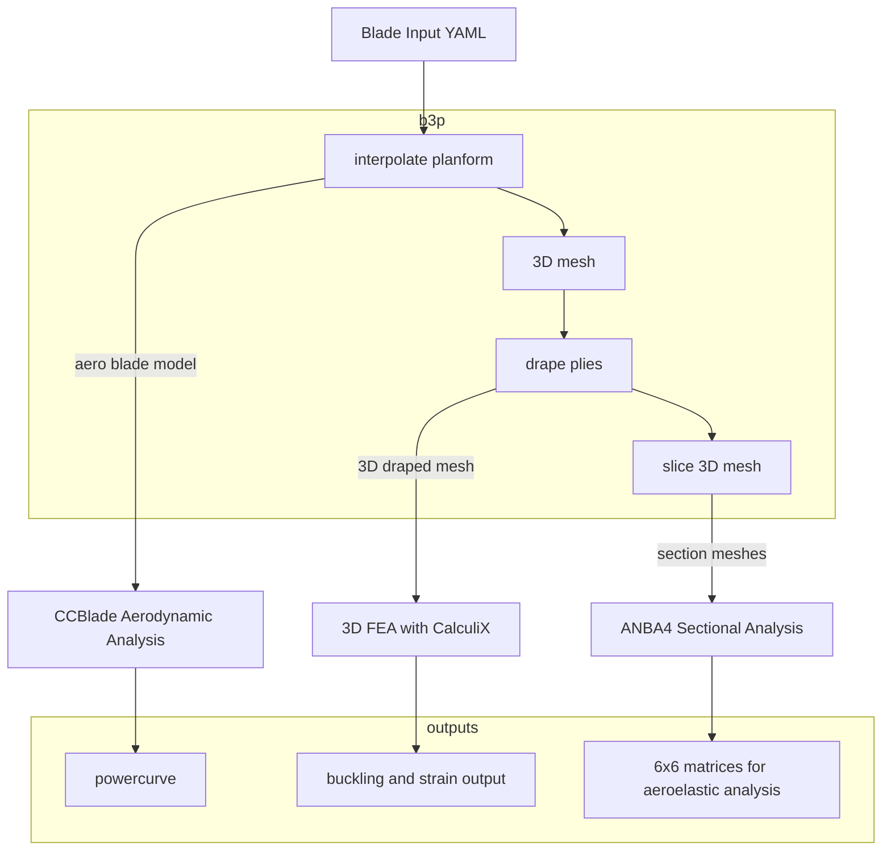

# Welcome to B3P Documentation

**B3P** (Blade Preprocessor) is a Python-based tool designed to preprocess wind turbine blade models for structural and aerodynamic analyses. 

It translates blade input files into formats suitable for solvers such as CalculiX (`ccx`), ANBA4 (`anba`), and CCBlade (`ccblade`). 

B3P supports the creation of 3D blade geometries, 2D sectional meshes, and finite element analysis (FEA) inputs, enabling comprehensive blade design and analysis workflows.

## Overview

B3P provides a command-line interface (CLI) and Python API to:

- Build 3D blade models from YAML input files.
- Generate 2D cross-sectional meshes for structural analysis.
- Perform aerodynamic analyses using CCBlade.
- Prepare and run 3D FEA with CalculiX.
- Drape composite plies and compute mass properties.

The following diagram illustrates the B3P workflow:



## Key Features

- **Modular Design**: Supports individual steps (e.g., geometry building, meshing, analysis) or complete workflows.
- **YAML Input**: Uses human-readable YAML files to define blade geometry, materials, and loads.
- **Composite Support**: Handles complex laminate definitions and ply draping.
- **Parallel Processing**: Leverages multiprocessing for efficient mesh conversions and analyses.
- **Visualization**: Generates output files compatible with tools like Paraview for result inspection.

## Getting Started

To begin using B3P, follow these steps:

1. [Install B3P](installation.md) via PyPI or from source.
2. Explore the [Usage Guide](usage.md) for CLI and API instructions.
3. Check out the [Input File Format](use/inputfile.md) to create blade definitions.
4. Run example workflows as described in [Examples](examples/blade_test.md).

## Build blade

```bash
usage: b3p [-h] {build,ccx,2d,ccblade,clean,validate} ...

Blade Design CLI

positional arguments:
  {build,ccx,2d,ccblade,clean,validate}
    build               Build the full blade model
    ccx                 Run Calculix operations
    2d                  2D mesh and ANBA4 operations
    ccblade             Run CCBlade analysis
    clean               Clean working directory
    validate            Validate YAML configuration

options:
  -h, --help            show this help message and exit
```


## Support

For issues, questions, or feature requests, visit the [GitHub repository](https://github.com/wr1/b3p) and open an issue.

