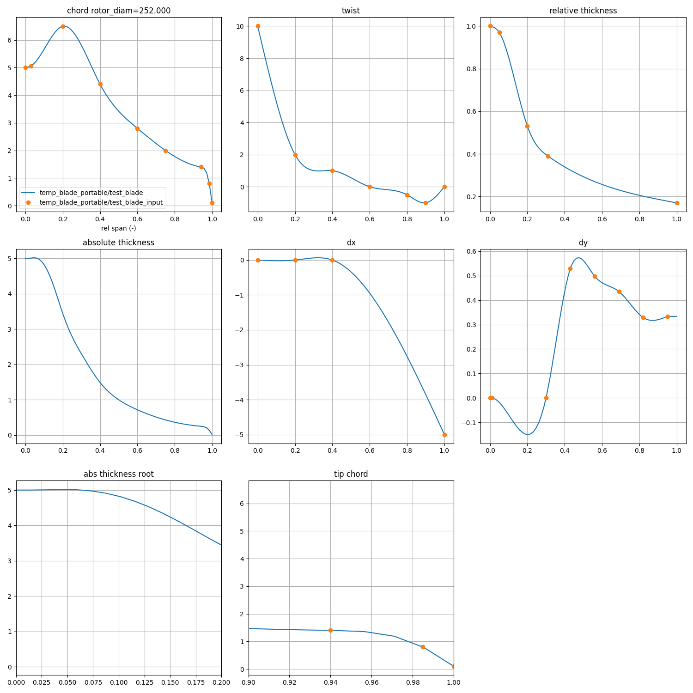

# Blade modeling
## Building a blade model
A b3p blade model is built using the following command:
```bash 
b3p build blade_test.yml
```
This is subdivided into the following steps:
```bash
usage: b3p [-h] {build,ccx,2d,ccblade,clean} ...

Blade Design CLI

positional arguments:
  {build,ccx,2d,ccblade,clean}
    build               Build the full blade model
    ccx                 Run Calculix operations
    2d                  2D mesh and ANBA4 operations
    ccblade             Run CCBlade analysis
    clean               Clean working directory

options:
  -h, --help            show this help message and exit
```

## Interpolation of planform parameters


## Creation of a 2D blade model


