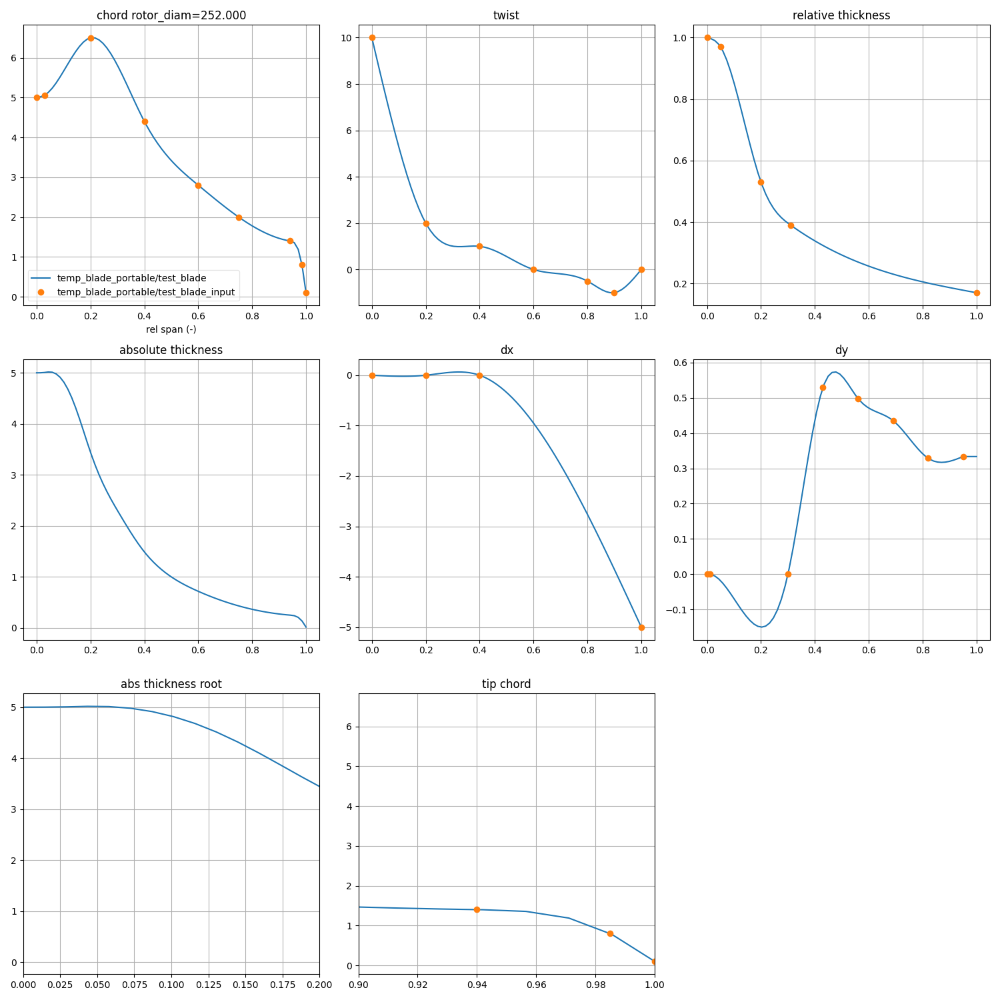

# Blade modeling
## Building a blade model
A b3p blade model is built using the following command:
```bash 
b3p build blade_test.yml
```
This is subdivided into the following steps:
```bash
usage: b3p [-h] {build,ccx,2d,ccblade,clean,validate} ...

Blade Design CLI

positional arguments:
  {build,ccx,2d,ccblade,clean,validate}
    build               Build the full blade model
    ccx                 Run Calculix operations
    2d                  2D mesh and ANBA4 operations
    ccblade             Run CCBlade analysis
    clean               Clean working directory
    validate            Validate YAML configuration

options:
  -h, --help            show this help message and exit
```

```bash
❯ b3p build -h
usage: b3p build [-h] [-n] yml {geometry,mesh,drape,mass,apply-loads} ...

positional arguments:
  yml                   Path to YAML config file
  {geometry,mesh,drape,mass,apply-loads}
    geometry            Build blade geometry
    mesh                Mesh blade structure
    drape               Drape plies onto mesh
    mass                Calculate blade mass
    apply-loads         Apply loads to mesh

options:
  -h, --help            show this help message and exit
  -n, --no-bondline     Exclude bondline
```

## Interpolation of planform parameters


<!-- ## Creation of a 2D blade model -->


